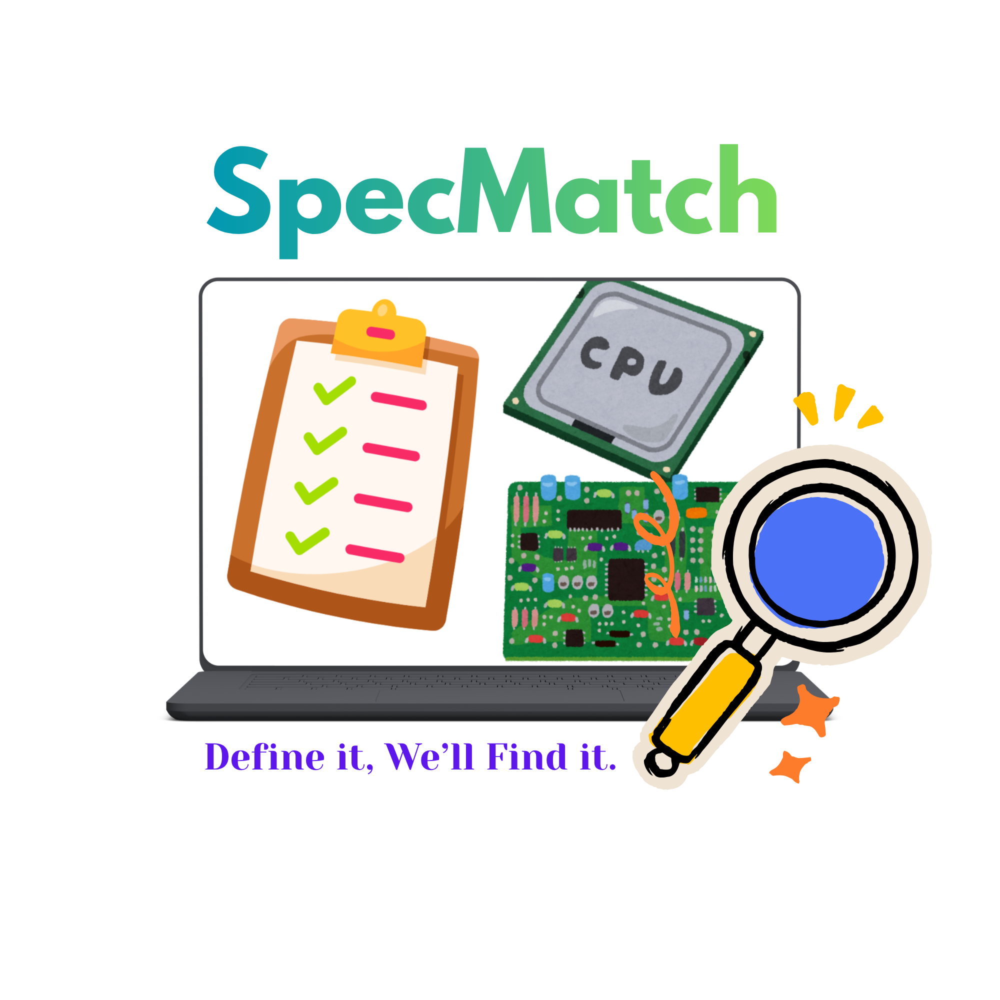

<div align="center">
  <h1>SpecMatch: Define it, We'll Find it</h1>
  
</div>

---  

## 📌 Tentang Proyek
SpecMatch adalah sistem rekomendasi yang dirancang untuk memberikan rekomendasi laptop terbaik kepada user berdasarkan kebutuhan dan preferensi yang diinput oleh user. 

## 📖 Latar Belakang  
Laptop merupakan salah satu perangkat penting yang digunakan untuk berbagai kebutuhan, seperti belajar, bekerja, produktivitas, desain, hiburan, hingga gaming. Namun, banyaknya pilihan laptop dengan spesifikasi yang berbeda sering membuat user kesulitan menentukan laptop yang paling sesuai.  
Dalam praktiknya, user sering mengetahui kebutuhan mereka secara umum, misalnya laptop untuk kuliah, kerja, penggunaan harian, atau gaming ringan. Akan tetapi, user belum tentu memahami detail teknis seperti CPU, GPU, RAM, storage, tipe laptop, ukuran layar, berat, sistem operasi, dan harga. Kondisi ini dapat membuat proses pemilihan laptop menjadi kurang efektif dan berisiko menghasilkan pilihan yang tidak sesuai dengan kebutuhan maupun budget user.  

## 🎯 Tujuan Proyek  
Project ini bertujuan membangun sistem rekomendasi laptop yang membantu user memilih laptop sesuai kebutuhan dan budget, terutama ketika user belum memahami detail teknis seperti CPU, GPU, RAM, storage, atau tipe laptop.  

## 📊 Dataset 
Sumber Dataset : [Laptop Price — Kaggle](https://www.kaggle.com/datasets/muhammetvarl/laptop-price)   
| Kolom | Deskripsi |
|---|---|
| Company | Produsen laptop |
| Product | Merek dan model laptop |
| TypeName | Jenis laptop (Notebook, Ultrabook, Gaming, dan lain-lain) |
| Inches | Ukuran layar laptop |
| ScreenResolution | Resolusi layar |
| Cpu | Prosesor utama (CPU) |
| Ram | Kapasitas RAM laptop |
| Memory | Kapasitas penyimpanan HDD/SSD |
| GPU | Kartu grafis (GPU) |
| OpSys | Sistem operasi |
| Weight | Berat laptop |
| Price_euros | Harga laptop dalam Euro |  

## 🧠 Metode  
* Content-Based Filtering
* Cosine Similarity
* ETL pipeline


## 🛠️ Tech Stack 
* **Library** : Pandas, Numpy, Matplotlib, Seaborn, Scikit-learn 
* **Data Engineering** : Airflow, Docker  
* **Visualization** : Tableau
* **Deployment** : HuggingFace, Streamlit

## 🖥️ Output Proyek  
[SpecMatch Dashboard](https://public.tableau.com/views/LaptopRecommendationOverview/Dashboard2?:language=en-US&publish=yes&:sid=&:redirect=auth&:display_count=n&:origin=viz_share_link)  
[SpecMatch App](https://huggingface.co/spaces/Lius175/final_project)  

## 📂 Struktur Proyek  
```
main/
├── Data Analysis/
|   ├── Dashboard_url.txt
|   └── Data_Analysis_Laptop_Recommendation.ipynb
|   
├── Data Engineer/
|   ├── dags/
|   |    ├── DAG.py
|   |    ├── laptops_data_clean.csv
|   |    └── laptops_data_raw.csv
|   |
|   ├── .env
|   └── airflow_final_project.yaml
|   
├── Data Science/
|   └── Data_Science_Laptop_Recommendation.ipynb
|
├── README.md
└── SpecMatch.png
```

## 🤝 Tim  
**FTDS Batch 038 — Hacktiv8 | Group 001**  
| Nama | Peran |
|---|---|
| Abdul Hakim Zelfi | Data Engineer — ETL Pipeline & Airflow |
| Lius Renaldi | Data Engineer — Airflow & Deployment |
| Raihan Ihsan Putra | Data Scientist — System Recommendation |
| Soraya Intan | Data Analyst — EDA, Business Insight, & Dashboard |

---  

<p align="center">
  <strong>SpecMatch</strong> · FTDS Batch 038 · Hacktiv8 · 2026
</p>


